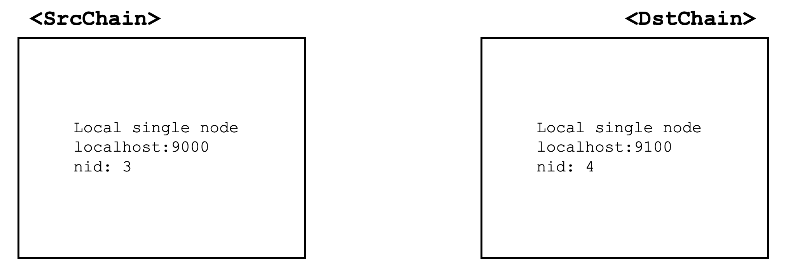
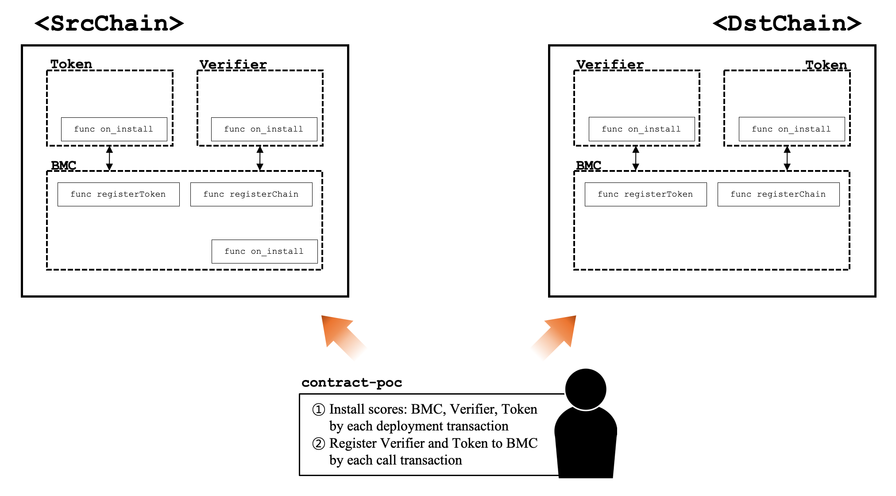
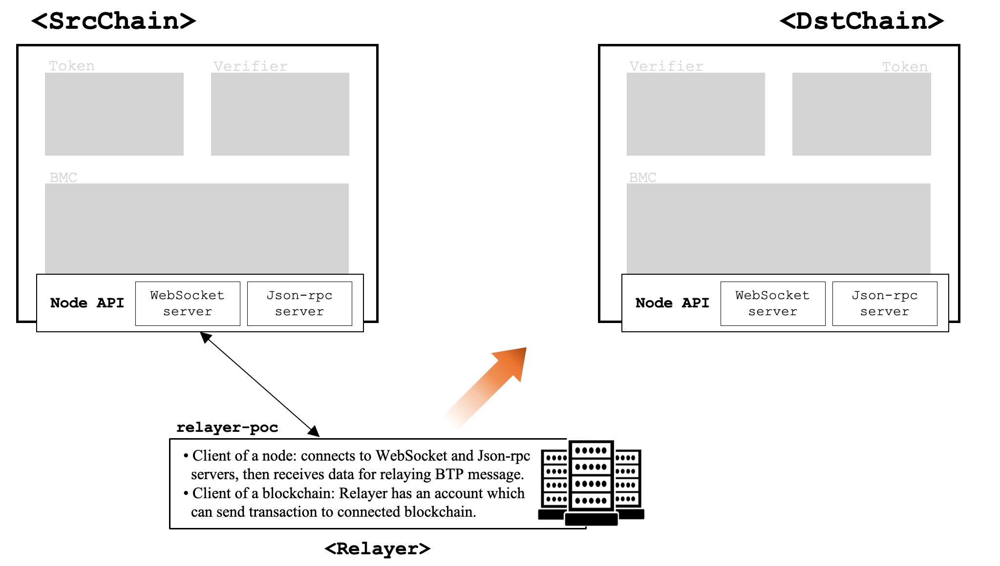
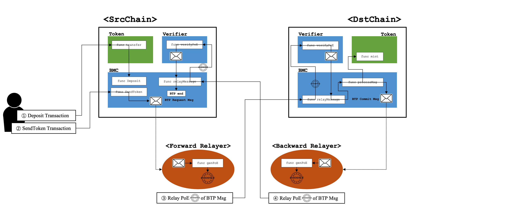

# ICON BTP v0.5 Proof of Concept

## Introduction
Blockchain Transmission Protocol (BTP) is a standard set of rules that allow users and smart contracts on a blockchain to communicate with other blockchains. Additionnlly, we designed BTP version 0.5 by utilizing record event message on the source blockchain and relaying it to the destination blockchain. For example, assume that Sender on “Blockchain A” wants to transfer a token to Receiver on “Blockchain B”. In that case, a pair of token scores should be deployed, one for each blockchain. The *Sender* sends a transaction to the token score on “blockchain A”, including an identifier for the destination blockchain, address of the *Receiver* and amount to be sent. Then, the token score on “blockchain A” records the transaction data as a BTP message on “Blockchain A”. Servers called *Relayers* always looks for BTP messages. When the Relayer finds a BTP message, it forwards the message to blockchain that corresponds to BTP message information. Finally, the token score on “blockchain B” will receive the contents of the BTP message then mint proper amount of tokens to be sent to *user B*. This PoC is intended to explain how to transfer a token between blockchains and provides python projects to run as an example.  

## Protocol Components
#### Two Single Node ICON Loopchains
*SrcChain* and *DstChain* consist of a single node blockchain respectively.
#### Token score and two BTP scores
Three scores, Token, BTP Menagement Center(BMC) and BTP Message Verifier(BMV) scores, must be deployed in advance on each blockchain.
#### Two One-way Relayer Servers
The *Forward Relayer* relays BTP message to *DstChain* if it encounters a BTP message while monitoring the *SrcChain*. In contrast, the *Backward Relayer* finds the BTP msg in *DstChain* and passes it to *SrcChain*. Therefore, two unidirectional *Relayers* work for BTP.
#### Two Users
This PoC project shows that *user A* on *SrcChain* sends token to *user B* on *DstChain*.
## Struct of Projects
icon-btp-0.5-PoC (project root) has three sub-projects:

sub-project|description
-----------|-----------
contract-poc|score deployer program and source code of the scores
relayer-poc|relayer source code and launcher
user-poc|PoC scenario implementation
docs|documentations
loopchain_config|configuration files of *SrcChain* and *DstChain*

## Tutorial
This guide will get you two local loopchain with 3 scores(smart contract) and 2 *Relayer* servers. With this tutorial you will able to send tokens to *user B* of *DstChain* from *user A* of *SrcChain*. Note that in order to demonstrate the scenario, you have to run at least 5 programs. It is recommended to run each program through the teminal.
#### Requeirements  
This PoC requires the following environments.
- Python
	- Version: Python 3.7+ (recommended 3.7.x)
	- IDE: Pycharm is recommended.

### Run Loopchains
Install and run two blockchains distinguishable by nids. Each blockchain consists of a single loopchain node running locally. Please refer to the following link: [Guide for install Loopchain](loopchain_config/loopchain_setting.md)

### BTP Scores Deployment
For BTP 0.5, three scores, Token, BMC, BMV, should be deployed on each blockchain. Both loopchains should be running before deploying the scores. Fortunately, we provide everything you need for deployment. Sub-project *contract-poc* includes the score source code and the deployer program. Please run the deployer program specified in the following link: [Run Deployer](contract-poc/README.md)

### Run Relayers
*Relayers* regularly monitor for new BTP messages from the read-chain. If a BTP message detected, the *Relayer* generates a proof of existance(PoE) value. The PoE value is used to verify the existence of the BTP message, and is then forwarded to the write-chain along with the contents of the BTP message itself.  
There are 2 types of *Relayers*, *Forward Relayer* and *Backward Relayer*. The only difference between the two is configuration. *Forward Relayer* sets *SrcChain* to read-chain and *Dstchain* to write-chain, while *Backward Relayer* sets the reverse. It means that both of *Relayers* standing different direction are requeired. You can run the *Relayers* by following the link: [Run Relayer](relayer-poc/README.md)

### Token Transfer Between 2 Blockchains
In this PoC, *user A* sends 3 transactions to *SrcChain*. First one requests tokens to faucet of token score for transfer testing. And second deposits an appropriate amount of tokens to BMC. After 2 transactions complete, *user A* sends *sendToken* transaction to BMC. it decreses deposit in BMC, record BTP message on *SrcChain* as a transaction receipt.  
When the *sendtoken* transaction completed, the *Forward Relayer* detects BTP message and send it to BMC on *DstChain* with PoE. the transaction makes token score mint tokens owned *user B* and BMC generate BTP message that contains specific work is complete. Then, *Backward Relayer* finds BTP message in *DstChain* and sends it to *SrcChain* in the same way of *Forward Relayer*. If the last transaction sent by the *Backward Relayer* succeeds, the BTP transfer is completed.  
*user-poc* represents the scenario described above and is available at link: [User Behavior](user-poc/README.md)  
#### User Behavior and BTP 0.5 Work Flow

