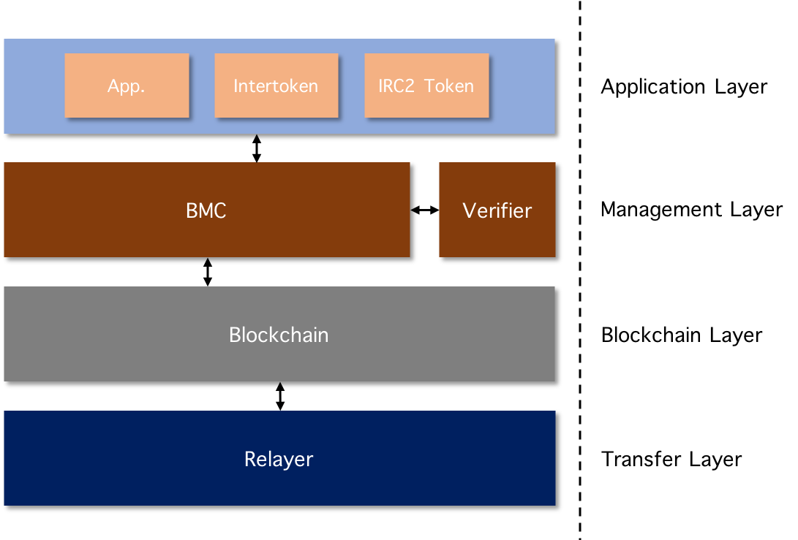

# Blockchain Transmission Procotol v0.5

BTP 프로토콜은 blockchain에서 다른 blockchain의 smart contract 실행할 수 있는 블록체인 간 통신 프로토콜이다. 더불어 smart contract가 다른 blockchain에 배치된 smart contract의 실행 결과에 따라 동작할 수 있으므로 세심한 protocol 설계가 요구된다. 특히 다른 blockchain에서 처리된 transaction 실행 결과를 수용하는 과정은 암호학적 안전성이 요구된다.  

BTP v0.5는 Relayer를 통한 blockchain간 통신을 지원하는 프로토콜이다. 

## 1. Protocol Conponents

### 1.1 srcChain and dstChain
BTP 0.5 버전의 경우 blockchain간 1:1 통신 기능을 지원하며 두 blockchain은 srcChain과 dstChain으로 구별한다. 이 명칭은 해당 blockchain의 실제 이름을 의미하지 않으며 프로토콜 기술에만 사용된다. 각 blockchain에는 BTP를 수행하는 BTP Contract가 사전에 배치되어야 한다.

### 1.2 User
Blockchain을 연결하는 BTP 기능을 통해 서로 다른 blockchain Node에 연결된 EOA가 상호 작용할 수 있다. BTP는 srcChain에 참여하는 Node의 Client가 BTP 기능을 요구하는 transaction을 발생시키면서 시작되지만, 설명하고자하는 시나리오에 따라 dstChain의 Client가 transaction을 전송할 수 있다. 예를 들어 srcChain의 User S는 자신이 보유한 token을 dstChain의 User D에게 전송할 수 있으며, 해당 토큰을 수신한 User D도 마찬가지로 User S에게 토큰을 전송할 수 있다.

### 1.3 Relayer
일반적으로 blockchain의 User가 다른 blockchain에 transaction을 전송할 수 없다. 따라서 BTP에서는 User S는 dstChain에서 실행될 transaction을 srcChain에 전송하고, BTP Contract가 해당 내용을 BTP msg 형태로 블록체인에 저장한다. 이 후 Relayer는 해당 BTP msg를 발견하여 dstChain의 BTP Contract에 전송하는 방식으로 BTP v0.5가 수행된다.
한편 dstChain에 배치된 BTP Contract는 Relayer를 신뢰할 수 없으므로 수신한 BTP msg가 srcChain에서 발생한 정당한 transaction인지 검증해야한다. 따라서 Relayer는 전달하는 BTP msg에 대한 Proof 값을 생성하여 dstChain의 BTP Contract에 전달한다.

## 2. BTP Contracts

### 2.1 Application Contract
Blockchain smart contract는 BTP기능을 통해 다른 blockchain의 smart contract와 연동하여 작업을 수행할 수 있다. 예를 들어 Application이 token contract인 경우, srcChain의 User는 srcChain의 token contract에 Transfer를 요청하여 dstChain에 배치된 token contract의 Transfer를 실행할 수 있다.

### 2.2 BTP Management Contract(BMC)

Management Layer의 작업 전반을 담당하는 System contract. BMC는 다음 작업을 수행한다.

##### 2.2.1 BTP Message 생성
BTP Message는 Application Layer에서 전달 받은 작업의 명세가 요약된 Message이다. BTP Message는 BMC가 생성하여 blockchain Layer에 전달하며
Transfer Layer를 거쳐 상대 체임의 BTP Layer로 전달된다.

##### 2.2.2 BTP Request 처리

BTP Message를 전달 받은 BMC는 다음 작업들을 수행한다. 

1. BTP Message 검증
수신 체인의 BMC는 해당 Message가 송신 체인에서 정당하게 수행되었음을 검증한다. 즉, BTP Message를 생성시킨 transaction의 Reciept가 송신 Chain에
존재하는지 검증한다. 검증에 필요한 값(Proof)는 BTP Message를 전달한 Relayer가 생성하여 전달하고, Verifier contract에서 검증이 이루어진다. 
Blockchain 별로 transaction의 모양과 합의 알고리즘이 상이할 수 있으므로 수신 Chain의 Verifier contract는 송신 체인의 관리자가 배치해야한다. 
2. BTP Message 해석
송신 chain에서 생성된 BTP Message를 수신 chain에서 처리할 수 있도록 변환한다. Blockchain 별로 transaction의 모양과 합의 알고리즘이 상이할 수 
있으므로 해석 알고리즘은 송신 chain의 관리자가 제공한다.   
3. BTP Message 실행
1, 2 과정을 거친 BTP Message는 수신 chain에서 실행 가능하다. BMC는 BTP msg를 실제 수행할 contract에 해당 내용을 전달하여, Message가 
목표하는 작업을 수행한다.

##### 2.2.3 BTP Message 실행 결과 반환
1, 2, 3 과정을 거쳐 수신한 BTP msg의 수행 결과를 송신 chain에 반환하기 위해 해당 내용의 BTP msg를 생성한다. 새롭게 생성된 BTP msg는
같은 방법으로 Relayer에 상대 체인에 전달된다. 단, 수행 결과가 담긴 BTP msg는 multi hops 통신의 경우 송신 chain이 아닌 다른 체인으로 전달 될 수 
있다. 하지만 BTP v0.5에서는 1:1 chain 통신만을 정의한다.   

##### 2.3 Verifier Contract
Transaction Receipt를 검증하고 BTP msg를 해석하는 작업을 수행하는 BMC의 모듈 contract. 상대 체인의 transaction과 Block의 구성과 합의 
알고리즘에 따라 알맞게 구현되어야 하므로 송신 Chain의 관리자가 해당 알고리즘을 제공한다.  

## 3. Layers of BTP
BTP은 다음 4개층을 통해 처리된다. srcChain의 Application Layer에 정의된 작업이 수행되면서 BTP 기능이 필요한 경우 Management Layer에 해당 작업
이 전달되고, 처리 결과가 blockchain Layer에 기록되고, Transfer Layer를 거쳐 dstChain으로 전달된다.        

### 2.1 Application Layer
Blockchain 위에서 수행될 작업이 정의되어 있는 모든 smart contract와 user account의 transaction이 Application layer에 해당된다. 특히 수행
될 작업이 BTP 기능을 요구한다면 작업 명세를 Management layer로 전달한다.

### 2.2 Management Layer
Management layer는 Application layer에서 요청된 작업 명세에 따라 BTP msg를 생성하여 Blockchain layer에 전달하거나, Blockchain 
layer에서 전달 받은 BTP msg를 처리한다. Management layer의 작업은 대부분 BTP management contract가 수행하지만 연결된 blockchain 별로
상이한 작업이 필요한 경우 별도의 contract와 연동되어 수행된다. 특히 상대 체인의 transaction이 처리 되었음을 주장하는 Proof를 검증하는 작업은 별도의
Verifier contract가 처리한다.

### 2.3 Blockchain Layer
Smart contract 실행 환경을 갖춘 blockchain. Management Layer의 작업 결과가 blockchain Layer에 기록된다. 작업 결과가 다른 blockchain에
전달되야 하는 경우 Transfer Layer에서 해당 내용을 참조하여 전달한다.  

### 2.4 Transfer Layer
srcChain의 blockchain Layer에 기록된 작업 결과를 dstChain의 BMC로 전달한다. Transfer Layer는 dstChain의 transaction을 작성해야 하므로
dstChain의 Account를 포함한다. 또한 해당 transaction에는 srcChain에서 처리된 작업 결과의 정당성을 주장하는 proof가 포함되어야 한다.

